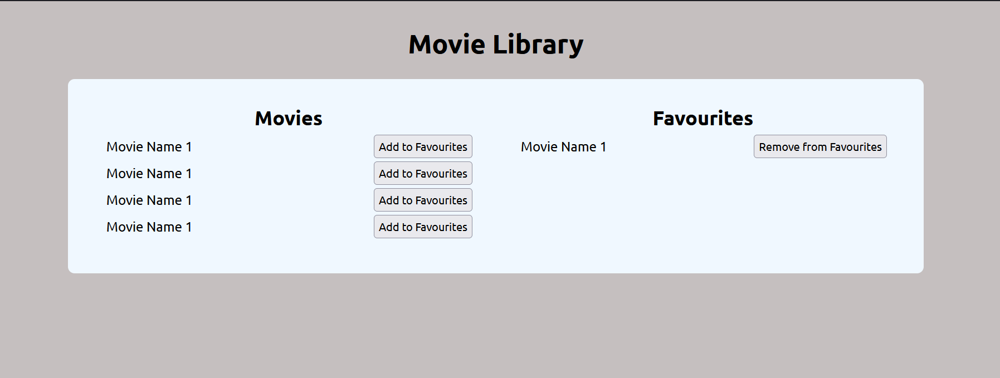

# Movie Library

## Objective

The Objective of this assignment is test your understanding on javascript programming and build interactive web pages using Javascript.

## Coding Guidelines

1. All your HTML code resides in `index.html`  
2. All your JavaScript code resides in the `js` folder  
3. All your CSS code resides in the `css` folder  
4. All your images resides in the `images` folder  
5. HTML, Javascript, CSS code should be well indented and commented  
6. You shall use Bootstrap to style your pages and elements  
7. The Assignment should be pushed to gitlab on completion

## Tasks

1. Populate the movie list with the movies from the `movies` array.
2. While populating the movie list, a button should be added to each movie item. The button should have the text `Add to Favourites`.
3. When the button is clicked, the movie should be added to the favourites list.
4. The favourites list should be displayed in a separate section.
5. While populating the favourites list a button should be added to each movie item. The button should have the text `Remove from Favourites`.
6. When the button is clicked, the movie should be removed from the favourites list and pushed back to the movie list.

## Screenshot

